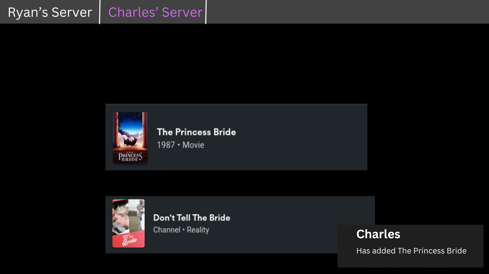
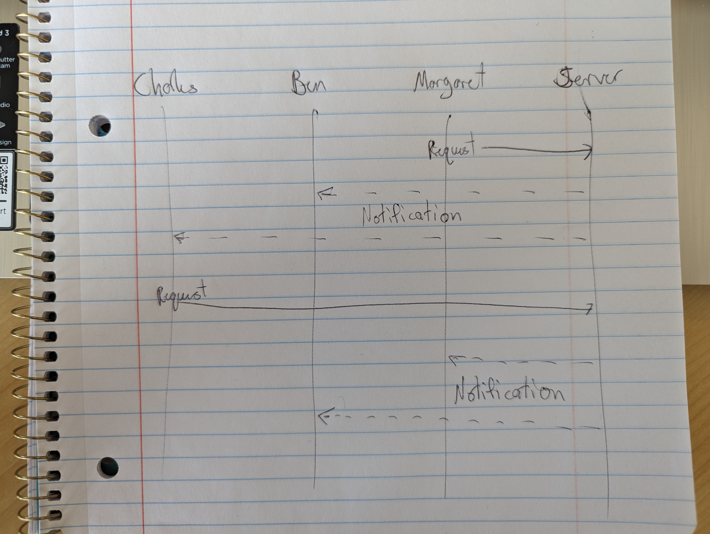

# Media Request

### Elevator Pitch

You know when you share a media server throughout your extended family and it is hard to communicate when you want a new movie or song to be added to the server. As an admin myself it can be tough to keep it all straight. Well, this media request web application will give everyone an opportunity to request any new thing they would like and it is easy for the admin to have one place where everyone has requested the things that they want. It will also be able to allow everyone to see what new thing has been requested so that they to can have the opportunity to view the media they may not have known they wanted to see. This way everyone can get what they want in the most efficient way possible.

### Design

Here is an example of the login page

